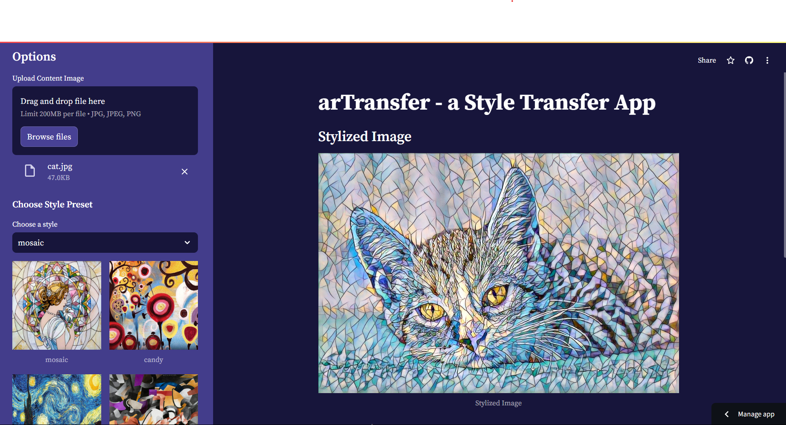

# arTransfer

#### arTransfer is a neural style transfer application that allows you to train your own models or use pre-trained models to stylize images. 

#### or Even directly use a style image and a content image to get the stylised output image. 

#### The application is organized with a focus on simplicity and efficiency, ensuring a smooth experience whether you're training a model or applying style transfer to an image.

## Directory Structure

```plaintext
arTransfer/
├── __pycache__/
├── ./streamlit/config.toml
├── app
|   └──app.py
├── datasets/mscoco
├── models/
│   ├── binaries/
│   └── checkpoints/
│── presets/
│── pretrained_models/
├── samples/
├── args.py
├── datasets.py
├── engine.py
├── gram_matrix.py
├── perpetual_loss.py
├── README.md
├── requirements.txt
├── styletransfer.py
├── stylize.py
├── todo.md
├── train.py
└── utils.py
```

## Getting Started

### Prerequisites
Clone the repo using git clone. 

```bash
git clone __repo__
```
Move inside folder arTransfer 
```bash
cd arTransfer
```

Ensure you have the necessary dependencies installed. You can install them using:

```bash
pip install -r requirements.txt
```


## Streamlit App
arTransfer also comes with a Streamlit app for interactive image stylization. The app allows you to upload a content image, choose a style preset, and apply style transfer using pre-trained models.

### Running the Streamlit App
- Navigate to the directory containing the Streamlit app i.e. 'app/' directory
- Run the Streamlit app using the following command:
```bash
streamlit run app.py
```

---
### Training the Model

To train the neural style transfer model, use the `train.py` script. This script will train the model using the MSCOCO dataset and save the model weights and checkpoints in the `models` folder.

### Download MSCOCO dataset from [this link.](http://images.cocodataset.org/zips/train2014.zip)

Note: Datasets should be places inside datasets directory. 

```bash
python train.py --content_dir path_to_content_images --style_dir path_to_style_images --output_dir path_to_save_models --epochs num_epochs --batch_size batch_size --lr learning_rate
```

#### Example:

```bash
python train.py --content_dir ./datasets/content --style_dir ./datasets/style --output_dir ./models --epochs 50 --batch_size  --lr 0.001
```


---


### Applying Style Transfer (stylize.py)

To apply style transfer to an image using pre-trained model weights, use the `stylize.py` script. This script will use the weights from the `pretrained_models` folder to stylize the input image.

```bash
python stylize.py --content_image path_to_content_image --output_image path_to_output_image --model_path path_to_pretrained_model
```

#### Example:

```bash
python stylize.py --content_image ./samples/cat.jpg --output_image ./samples/stylized_cat.jpg --model_path ./models/pretrained_models/style_model.pth
```

---

## Live Training Script (`styletransfer.py`)

This script offers a live training solution for style transfer, allowing you to use custom style images for stylizing content images quickly. Although results may vary in accuracy due to limited training time on-device CPU, this method provides flexibility when preset styles are not available.

### Usage

2. **Run Script**: Execute `styletransfer.py` to start live training:

   ```bash
   python train.py --content content_image.jpg --style style_image.jpg
   ```

   Adjust `steps_to_run_for` (default: 2000) for longer or shorter training durations.

### Note

- **Performance**: Results may not match those of pre-trained models due to limited live training resources. Accuracy might be low.

---

## Samples

<!-- Original image with specific width -->


<!-- Stylized images with resized dimensions -->


---
## Acknowledgments

- This project is inspired by the original neural style transfer paper by Gatys et al.
- HUGE HUGE Thanks to gordicaleksa for the awesome repo on NST https://github.com/gordicaleksa/pytorch-neural-style-transfer . It became my go-to place for every query regarding NST.
---

## Contact

For any questions or issues, please contact Sandesh Shrestha at [sandesh.cdr@gmail.com](mailto:sandesh.cdr@gmail.com)

[Portfolio](iiierie.github.io)

---

